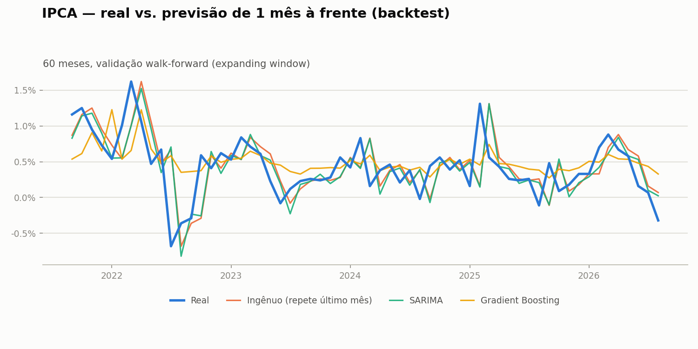

# IPCA — Extração e Visualização

Pipeline que extrai a série histórica completa do IPCA (Índice Nacional de Preços ao Consumidor Amplo) diretamente da API de Agregados do IBGE (tabela SIDRA 1737, nível Brasil), limpa os dados e gera um gráfico da variação mensal desde 1979.

Os dados são atualizados automaticamente todo mês via GitHub Actions, então o CSV e o gráfico neste repositório refletem sempre a divulgação mais recente do IBGE.

## Como funciona

| Etapa | Arquivo | Responsabilidade |
|-------|---------|-------------------|
| **Extração** | `extrair_ipca.py` | Consulta a API SIDRA do IBGE e salva a série completa em `ipca.csv`. |
| **Visualização** | `grafico_ipca.py` | Lê `ipca.csv` e gera `ipca_variacao_mensal.png`, com um painel da série completa (mostrando a hiperinflação pré-Real) e outro recortado a partir do Plano Real (jul/1994), onde a escala moderna fica legível. |
| **Automação** | `../.github/workflows/atualizar-ipca.yml` | Roda os dois scripts todo mês e commita os arquivos atualizados. |

### Variáveis extraídas

- Número-índice
- Variação mensal (%)
- Variação acumulada em 3, 6 e 12 meses (%)
- Variação acumulada no ano (%)

## Previsão do IPCA

`prever_ipca.py` compara três formas de prever a variação mensal do IPCA 1 mês à frente, com validação **walk-forward** (janela expansiva: a cada mês do teste, o modelo só enxerga dados até o mês anterior):

- **Ingênuo** — repete o valor do último mês (baseline de sanidade).
- **SARIMA** — modelo estatístico clássico de série temporal, com sazonalidade de 12 meses.
- **Gradient Boosting** — modelo de ML (`HistGradientBoostingRegressor`) com features de defasagem (lags de 1, 2, 3, 6 e 12 meses, médias móveis e mês do ano).

Resultado do backtest nos últimos 60 meses (erro absoluto médio e raiz do erro quadrático médio, em pontos percentuais):

| Modelo | MAE | RMSE |
|--------|-----|------|
| Ingênuo | 0,295 | 0,395 |
| SARIMA | 0,290 | 0,394 |
| Gradient Boosting | 0,281 | 0,380 |



O ganho do ML sobre o baseline ingênuo é pequeno — esperado, já que os modelos usam apenas a própria série histórica do IPCA, sem variáveis exógenas (Selic, câmbio, expectativas do boletim Focus etc.). O valor do experimento está em comparar metodologias com validação honesta, não em bater recorde de erro. Diferente da extração de dados, essa análise **não roda automaticamente** — é um script para reexecutar manualmente quando o CSV for atualizado.

## Estrutura do projeto

```
.
├── extrair_ipca.py            # Extração + limpeza dos dados
├── grafico_ipca.py             # Gráfico da série histórica
├── prever_ipca.py              # Backtest walk-forward dos 3 modelos de previsão
├── grafico_previsao.py         # Gráfico real vs. previsões do backtest
├── ipca.csv                    # Série histórica atualizada
├── ipca_variacao_mensal.png    # Gráfico da série atualizado
├── backtest_previsao.csv       # Previsões mês a mês do backtest
├── metricas_previsao.csv       # MAE/RMSE de cada modelo
├── previsao_ipca.png           # Gráfico real vs. previsões
└── requirements.txt
```

## Como executar

```bash
pip install -r requirements.txt
python extrair_ipca.py
python grafico_ipca.py
python prever_ipca.py
python grafico_previsao.py
```

## Tecnologias

- **Python 3**
- **requests** — consumo da API do IBGE
- **pandas** — limpeza e estruturação dos dados
- **matplotlib** — visualização
- **statsmodels** — modelo SARIMA
- **scikit-learn** — modelo de gradient boosting
- **GitHub Actions** — atualização mensal automática dos dados

## Autor

Ítalo Mendonça de Souza — Bacharelado em Ciência de Dados e IA (UFPB)
